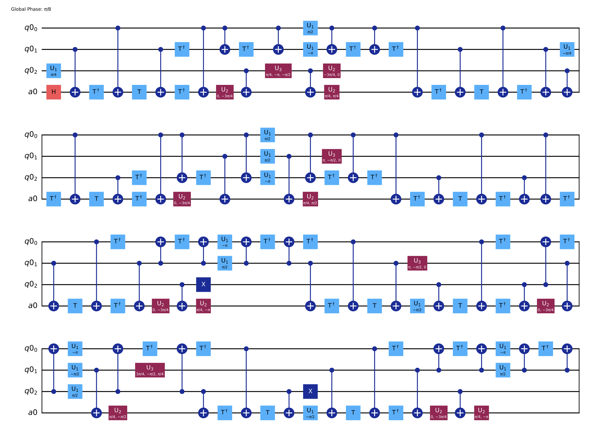

# quantum-simulations

[](https://www.python.org/)
[](LICENSE)
[]()  
*A generic quantum compiler for quantum computing*

Given a Hamiltonian — even its most general Lindblad form, i.e., Lindbladian — this tool compiles it into an executable quantum circuit. It currently supports **Cirq**, **Qiskit**, **Quimb**,
and is designed to be extensible to other frameworks. For example,

📄 [](docs/qc_qiskit_sketch.pdf)

This sketch was generated by first compiling the a `8x8` cyclic permutation matrix, and then render the compiled code on [Qiskit](https://github.com/qiskit). 

Check out the demos here with your own input:
👉 [Demo Directory](https://github.com/wanshoupu/quantum-simulations/blob/main/quompiler/demo)

---

## 🚀 How to Use the Package

### 🖥️ Running Locally

#### 1. Clone the Repository

```bash
git clone https://github.com/wanshoupu/quantum-simulations.git
cd quantum-simulations
```

#### 2. Run the Demo from Terminal

```bash
python -m quompiler.demo.compile_unitary_demo -i 3
```

---

### 📓 Running on Google Colab

#### 1. Install the Package

Create a new cell and run:

```bash
!pip install git + https: // github.com / wanshoupu / quantum - simulations.git
```

#### 2. Run the Demo

In a new cell:

```bash
!python - m quompiler.demo.compile_unitary_demo - i 6
```
## 🧪 Tests
Unit tests are written using Pytest. To run them, first install pytest with:
```bash
!pip install pytest
```
To run all tests, open a terminal and run
```bash
pytest
```
To run specific tests, run
```bash
pytest tests/qompiler/utils/test_group_su2.py::test_vec_std
```
---

## 🤝 Contributing

Contributions are welcome! To get started:

1. Fork the repository and clone your fork.
2. Create a new branch for your feature or bugfix.
3. Make your changes and ensure existing demos still run.
4. Submit a pull request with a clear description of your changes.

Suggestions for improvements, new features, or better documentation are always appreciated.

---

## 🛣️ Roadmap

Planned features and improvements:

- [ ] Support for more quantum frameworks (e.g., Braket, PennyLane)
- [ ] Circuit optimization strategies based on hardware constraints
- [ ] GPU-accelerated simulations
- [ ] Web-based interface for inputting Hamiltonians and visualizing circuits
- [ ] Integration with quantum error correction modules
- [ ] Unit tests and CI setup for better reliability
- [ ] Comprehensive documentation with usage examples

---

## 👥 Contributors

- **[@wanshoupu](https://github.com/wanshoupu)** – creator & maintainer  
  Want to contribute? [Submit a pull request](https://github.com/wanshoupu/quantum-simulations/pulls)!

---

## 📄 License

This project is licensed under the [MIT License](LICENSE).

---
